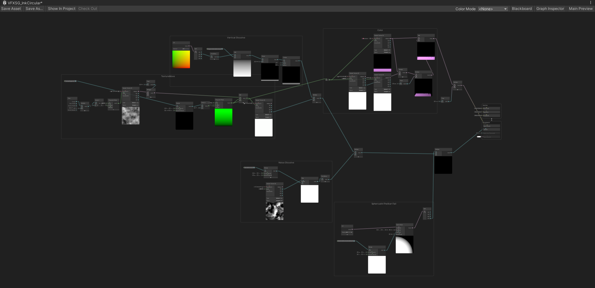
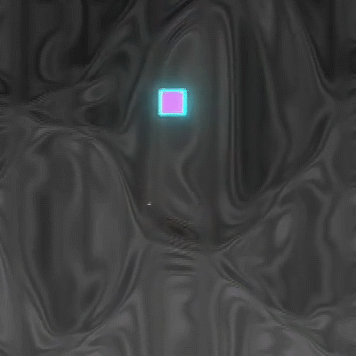
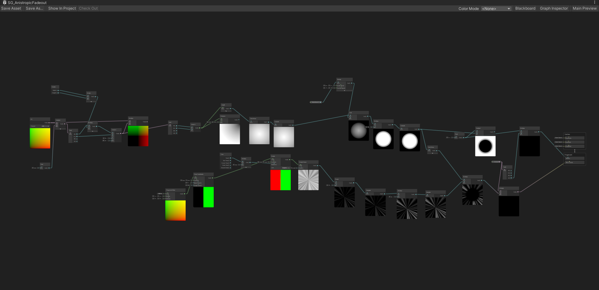
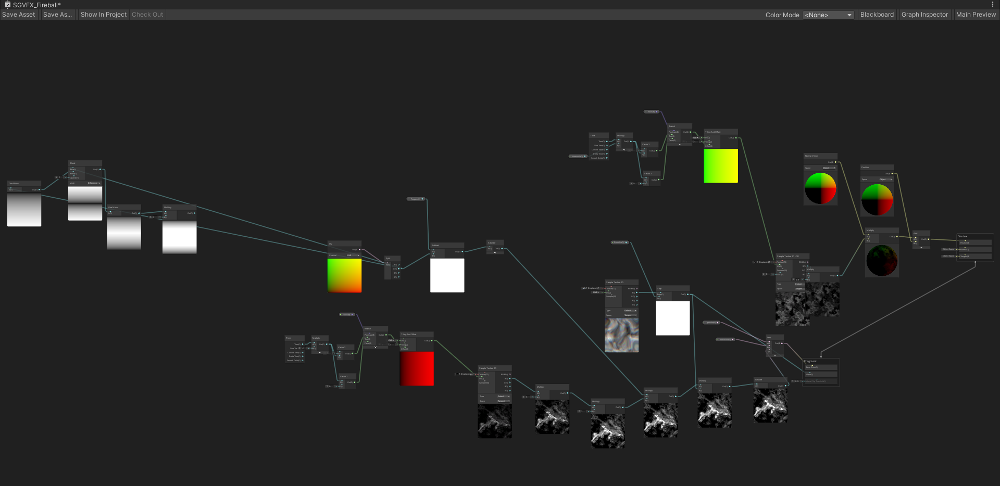
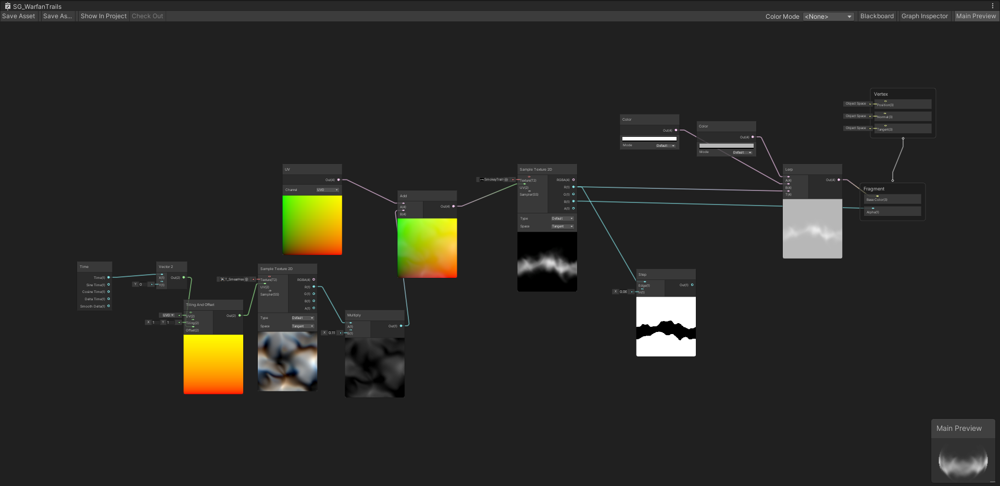
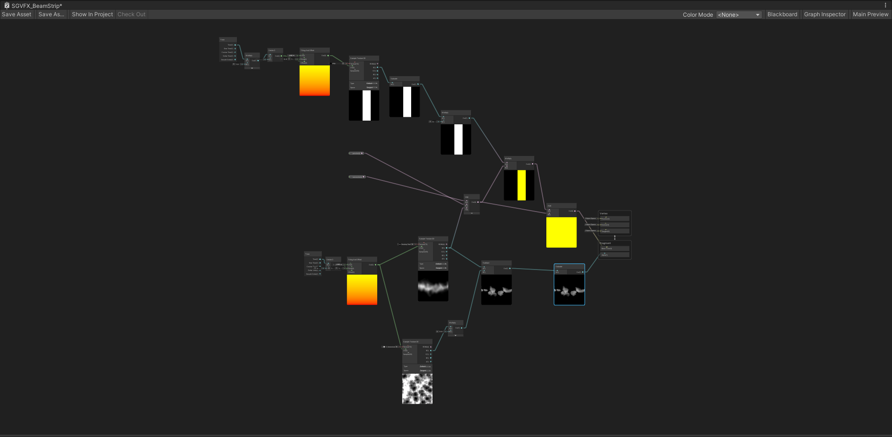

# Example Shader Graph Materials

These are some of the shader graphs I have created over the course of 2023. They are taken from multiple projects.

Some of them are extremely simple while some of them are complex, some of them have comments while some don't. Some graphs looks extremely messy while others look neat.

You are welcome to clone the repository and play with the graphs. I'm pretty sure there are some neat tricks you can use in your projects.

### IMPORTANT
VFExtra folder is a dependency and must be filled before opening the project. This is an amazing library made by Niels, and it's licensed under CC BY 4.0 license. Full dependency list is listed at the end of this readme. Please take caution. Download the texture pack here: nielsdewitte.be/VFExtra/. 

Other textures that are bundled together are made by me, or created using the programs I have made.

## Examples 

### Ink Circular Graph

Parameters are then controlled using a Visual Effect Graph to achieve this effect: 

----

### Anistropic Focus

----

### Fireball

----

### Simple Trail Example

----

### Beam With a Pulse

## Dependency Texture Names

- T_BlurNoise001.tga
- T_BlurNoise007.tga
- T_BlueNoise009.tga
- T_BlueNoise010.tga
- T_DisplaceNoise001.tga
- T_DisplaceNoiseBlur001.tga
- T_DisplaceNoiseBlur003.tga
- T_DisplaceNoiseBlur005.tga
- T_DisplaceNoiseBlur006.tga
- T_DisplaceNoiseCABlur002.tga
- T_DisplaceNoiseCABlur006.tga
- T_DisplaceNoiseCABlur008.tga
- T_DisplaceNoiseCABlur009.tga
- T_DisplaceNoiseCABlur010.tga
- T_DisplaceNoiseCABlur011.tga
- T_DisplaceNoiseCABlur014.tga
- T_DisplacePatternBlur012.tga
- T_DisplaceVoronoiseBlur002.tga
- T_DisplaceVoronoiseBlur003.tga
- T_DisplaceVoronoiseBlur004.tga
- T_DisplaceVoronoiseBlur005.tga
- T_DisplaceVoronoiseBlur008.tga
- T_Gradient001.tga
- T_GradientNoise002.tga
- T_GradientNoise004.tga
- T_GradientNoise009.tga
- T_MultiNoise001.tga
- T_RainBow008.tga
- T_Ring001.tga
- T_SmearHex003.tga
- T_SmearNoise005.tga
- T_SmearNoise007.tga
- T_SmearNoiseCA001.tga
- T_SmearNoiseCA006.tga
- T_SmearVoronoise001.tga
- T_SmearVoronoise002.tga
- T_SmearVoronoise003.tga
- T_SmearVoronoise004.tga
- T_SmearVoronoise005.tga
- T_SmearVoronoise006.tga
- T_SmearVoronoise007.tga
- T_SmearVoronoise008.tga
- T_SmearVoronoise009.tga
- T_SmearVoronoise010.tga
- T_Voronoise007.tga